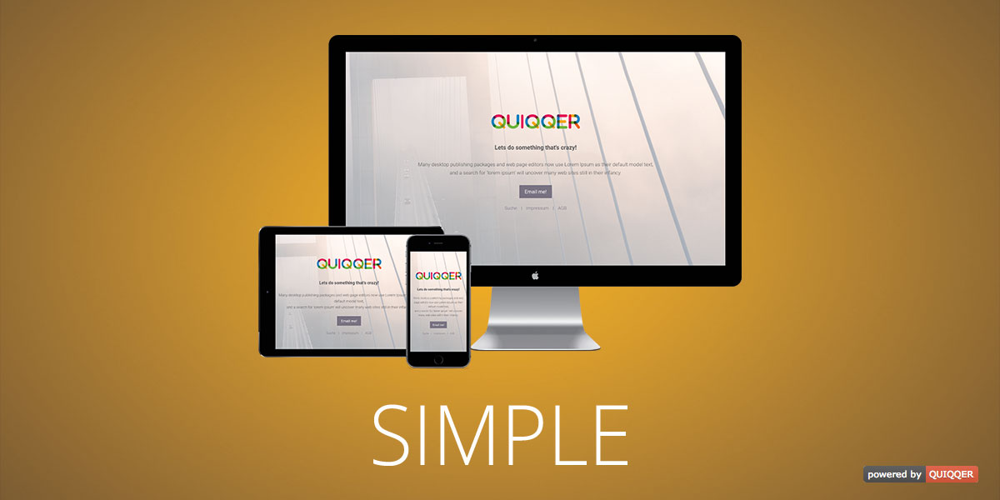

QUIQQER Simple
========

Extremely simple one page template for announcing the basic information about the project, website or product.

Package name:

    quiqqer/template-simple

Features
--------
- Image or color as background
- Second layer with adjustable color and opacity
- Variable colors
- Responsive
- FontAwesome support

Installation
------------

The package name is: quiqqer/template-simple

Contribute
----------

- Issue Tracker: https://dev.quiqqer.com/quiqqer/template-simple/issues
- Source Code: https://dev.quiqqer.com/quiqqer/template-simple

Support
-------

If you have found a bug or want to make improvements,
then you can write an e-mail to support@pcsg.de.

License
-------

GPL-3.0+